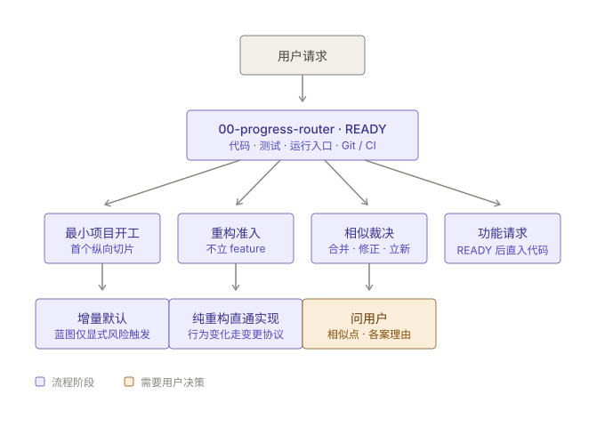
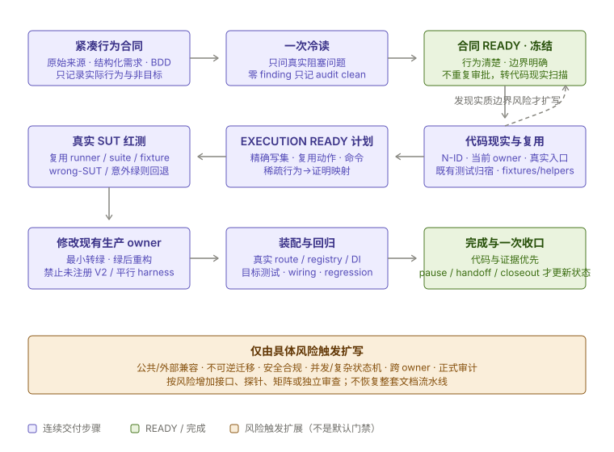

# General Workflow Skill

This repository develops the `general-workflow` Codex skill: a staged, document-governed workflow for discovering behavior with BDD and delivering vertical features across UI, runtime contracts, backend logic, infrastructure, and E2E acceptance.

The skill helps Codex:

- detect the current workflow stage from repository evidence;
- load only the reference document needed for that stage;
- preserve requirements, contracts, plans, tests, and evidence;
- distinguish product/module/feature/use-case/task levels and map one feature across its full-stack code homes;
- turn scenario rosters into BDD Rules, concrete Given/When/Then Examples, and explicit Questions before interface design;
- use a requirement-to-test matrix and behavior-sized red-green-refactor loops;
- prove frontend/backend contracts, cross-feature effects, user flows, and final Definition of Done;
- keep the main conversation as the orchestrator while subagents act as scoped executors;
- handle refactors, implementation, review, verification, and change recovery without reading the full source workflow every time.

## Workflow overview

Every request enters through the progress router, which scans repository evidence and routes to one of four paths. Refactors never become features; similar requirements are triaged (merge / revise / new) before any folder is created:



A feature request runs the single-feature pipeline (incremental mode). Amber boxes are human gates; after every stage the agent returns to the router. In blueprint mode the first three segments run as batches over all features with three batch reviews before parallel implementation:



The numbered document set (`00-…` to `99-…`) doubles as the user's dashboard: requirement docs show whether intent was captured, contract/plan docs show what will be built, the Feature Test Matrix in `02-测试矩阵.md` shows each scenario across Domain/Use Case/frontend/adapter/contract/feature-integration/cross-feature/E2E layers and resolves every test ID to execution evidence, and `09-完整性审计.md` decides whether the assembled feature is genuinely complete.

## Repository layout

```text
.
├── SKILL.md
├── agents/
│   └── openai.yaml
├── references/
│   ├── 00-progress-router.md
│   ├── 00-orchestration-policy.md
│   ├── 00-pacing-mode.md
│   ├── 00-refactor-intake.md
│   └── ...
├── scripts/
│   └── check_consistency.py
├── 通用开发工作流-v3.8-环节拆分版.md
├── CHANGELOG.md
└── README.md
```

Important distinction:

- `SKILL.md`, `agents/`, and `references/` are the reusable Codex skill package.
- `通用开发工作流-v3.8-环节拆分版.md` is source material for the split references.
- `README.md` documents this repository; it is not required inside the installed skill package.

## Skill behavior

The skill uses progressive disclosure:

1. Start from `SKILL.md`.
2. Always read `references/00-progress-router.md` first.
3. Select the current stage from repository evidence.
4. Load only the reference file needed for that stage.

The orchestration model is explicit:

- the current conversation is the orchestrator;
- subagents are executors;
- once a scope is assigned to an executor, the main thread must not implement the same scope in parallel;
- the main thread owns integration, conflict resolution, final verification, and user communication.

## Key references

| File | Purpose |
|---|---|
| `references/00-progress-router.md` | Choose the current workflow stage and next reference. |
| `references/00-orchestration-policy.md` | Define main-thread orchestration and subagent executor boundaries. |
| `references/00-pacing-mode.md` | Choose blueprint or incremental pacing; blueprint batch gates. |
| `references/00-refactor-intake.md` | Reconfirm requirements/contracts before refactor work. |
| `references/03-bdd-example-mapping.md` | Map requirements into observable Rules, Examples, and Questions before contracts. |
| `references/06-planning.md` | Build implementation plans and executor scopes. |
| `references/06-test-strategy.md` | Build the Feature Test Matrix coverage view and executable evidence register. |
| `references/08-implementation.md` | Implement against frozen contracts and red tests. |
| `references/09-review-and-verification.md` | Verify behavior, evidence, ownership, and acceptance. |
| `references/09-feature-completeness.md` | Audit the test matrix and Definition of Done before closeout. |

## Validate

There is no application build system. Useful checks:

```powershell
Get-ChildItem -Force
Select-String -Path *.md -Pattern '^#{1,4}\s+'
git diff --check
python scripts/check_consistency.py
$env:PYTHONUTF8 = 1   # required on GBK-default Windows: quick_validate.py reads UTF-8 files without declaring an encoding
python "<path-to-skill-creator>\scripts\quick_validate.py" (git rev-parse --show-toplevel)
```

`check_consistency.py` verifies that `references/*.md`, the `SKILL.md` Reference Map, and cross-file mentions stay in sync, and that every reference is reachable from the router. Run it before committing changes to `SKILL.md` or `references/`.

`git diff --check` may print CRLF conversion warnings on this Windows checkout; distinguish those from real whitespace errors.

## Install or sync locally

To use this checkout as the local Codex skill, copy only the skill package files:

Validate the source checkout first (see above), then copy:

```powershell
$src = git rev-parse --show-toplevel
$dst = Join-Path $env:USERPROFILE ".codex\skills\general-workflow"

New-Item -ItemType Directory -Path $dst -Force | Out-Null
Copy-Item -LiteralPath (Join-Path $src "SKILL.md") -Destination (Join-Path $dst "SKILL.md") -Force
robocopy (Join-Path $src "agents") (Join-Path $dst "agents") /MIR
robocopy (Join-Path $src "references") (Join-Path $dst "references") /MIR
```

Note: `/MIR` mirrors — it deletes files in the target that no longer exist in the source, so local patches in the installed copy are overwritten. robocopy exit codes 0-7 all mean success; only >=8 is failure.

Then validate the installed copy:

```powershell
python "<path-to-skill-creator>\scripts\quick_validate.py" $dst
```

## Development notes

- Keep `SKILL.md` concise; move stage details into `references/`.
- Keep references one level deep and directly discoverable from `SKILL.md`.
- Do not duplicate long workflow text across files.
- Treat a Feature as a vertical user capability, not a synonym for one backend folder or one API endpoint.
- Update `agents/openai.yaml` when the trigger behavior or default prompt changes.
- Do not store secrets, credentials, private host details, or project-specific business data in the skill.

## License

MIT — see [LICENSE](LICENSE).
