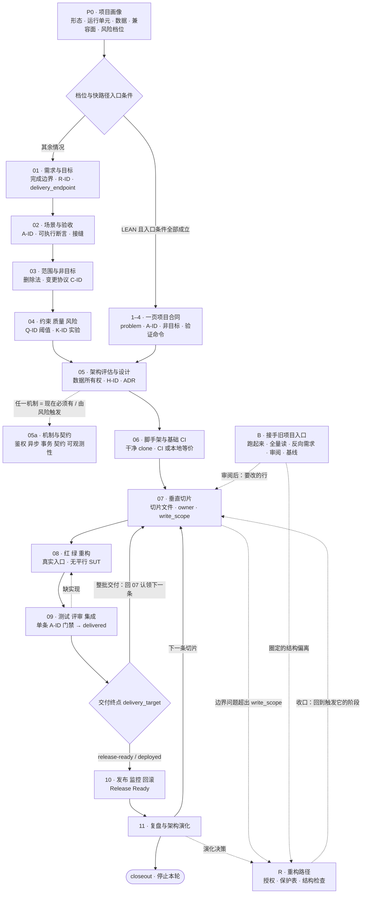
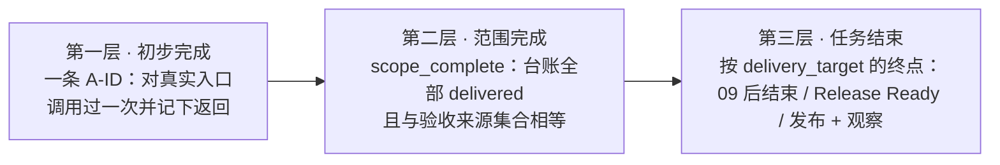

# General Workflow

一套给 agent 用的**从零搭建软件项目**的开发工作流。它不是一份让人读的流程手册，而是一组
agent 每轮只加载一份、按证据推进、并且能被脚本拒绝的阶段门禁。

主线从"要解决谁的什么问题"开始，经过架构与工程基础，交付一条真实可运行的垂直切片，再进入
测试、发布和运行反馈。整个过程可以跨会话接手，也可以随时插入第二个人。

## 总图



三件事值得先说清楚：

- **只有阶段 1–4 会合并。** LEAN 档位把它们压成一页项目合同；05 之后所有档位都逐阶段路由，
  LEAN 改变的是每个阶段要求的证据量，不是阶段数。减免清单只有
  [`00-lean-path.md`](references/00-lean-path.md) 那一份，没列到的门禁照原样执行。
- **09 之后往哪走不是判断题**，查 `delivery_target` 的终点：逐条上线的切片过 09 就进 10，
  再经 11 回 07；整批交付留在 07 继续认领，直到台账没有 remaining 才按终点收尾。
- **任意阶段都可能回流。** 拆解暴露意图歧义、核心目标矛盾或画像前提失效时先回 P0；
  局部问题按最小影响回退到 01/02/03/04，见下面的[回流表](#回流按最小影响回退)。

## 它和一份流程手册的区别

四条规则决定了其余全部形态：

1. **按最早未满足的「事实」路由，不是按最早缺失的「文档」。** 文件存在不代表门禁通过。
2. **一次只加载一份 reference。** 常驻的只有 `SKILL.md` 和 router，其余按阶段付费。
3. **完成是可以被机器拒绝的状态，不是可以被叙述的判断。** 验收来源与台账做集合相等校验，
   `delivered` 单调不可退且必须带证据指针。
4. **状态分片落盘。** 最频繁的写入只碰一个单人独占的文件，所以第二个人可以随时插进来。

## 安装

这个仓库本身就是 skill 包。`archive/` 不属于安装内容。

**必须把 `scripts/` 一起装上** —— 每个有状态的会话，router 第一步就要调用
`scripts/workflow_status.py`；只拷 `SKILL.md` 和 `references/` 会让它第一步就失败。

两个版本都**先删掉已有的目标目录，再拷贝**。`Copy-Item -Recurse` 和 `cp -r` 在目标已存在时
不覆盖它，而是把源目录整个塞进去，装出
`.../skills/general-workflow/general-workflow/SKILL.md` 这样的两层结构。加载的仍是外层那份
旧文件，新版本躺在下一层没人读，而且不会有任何报错提示这件事。

```powershell
git clone git@github.com:Brianky111/general-workflow.git
Remove-Item -Recurse -Force -ErrorAction SilentlyContinue "$HOME\.claude\skills\general-workflow"
Copy-Item -Recurse general-workflow "$HOME\.claude\skills\general-workflow"
Remove-Item -Recurse -Force "$HOME\.claude\skills\general-workflow\archive"
```

```bash
git clone git@github.com:Brianky111/general-workflow.git
rm -rf ~/.claude/skills/general-workflow
mkdir -p ~/.claude/skills
cp -r general-workflow ~/.claude/skills/general-workflow
rm -rf ~/.claude/skills/general-workflow/archive
```

bash 版多一行 `mkdir -p` 是因为两个命令并不等价：`Copy-Item -Recurse` 会自己补出中间目录，
`cp -r` 不会，父目录不存在时它直接报
`cp: cannot create directory ...: No such file or directory` 并退出 1，一个文件都没装上。
全新机器上 `~/.claude/skills` 通常还不存在，所以这一行不是可省的礼貌写法。

**升级必须重装**：`git pull` 之后把上面这几行原样再跑一遍。装出来的是一份副本，
**它不会跟着仓库更新**——本机就出现过装的是几个月前的版本，目录里连 `scripts/` 都没有，
而 router 第一步就要调 `workflow_status.py`，于是每个有状态的会话都在第一步失败。

想省掉重装，或者要一边用一边改这套流程，就别拷贝，直接链接过去（Windows 需要开发者模式或
管理员权限）：

```powershell
New-Item -ItemType SymbolicLink -Path "$HOME\.claude\skills\general-workflow" -Target "<本仓库绝对路径>"
```

Codex 侧用 `agents/openai.yaml` 提供入口元数据，包内容相同，按你本地 Codex 的 skill 目录约定放置。

装完拿一个还没有状态的目录确认一下：

```powershell
python "$HOME\.claude\skills\general-workflow\scripts\workflow_status.py" --root "C:\some\project"
```

逐字输出这两行、退出码 0，就说明 `scripts/` 装到位了，而且空目录没有被当成坏状态：

```text
no workflow state; derive the stage per 00-progress-router.md and create it this round
0 error(s)
```

报 `can't open file` 是只拷了 `SKILL.md` 和 `references/`，或者装的是没有 `scripts/` 的旧副本。

## 怎么用

### 第一次会话

在你的项目目录里直接说要做什么，或者用 `/general-workflow` 显式触发：

> 我要做一个内部用的报表导出工具，Python，先跑起来。用 general-workflow。

agent 会按固定顺序动作：先读 router → 分清你是问方法还是要动手（只问方法就直接回答，不落盘
任何文件）→ 找 `docs/workflow/`，有就跑状态脚本，没有就看仓库：空的推导阶段，已有代码走接手入口 → 选中最早未满足门禁的那个
阶段 → 只加载那一份 reference → 本轮结束前建立状态文件。

第一次会话一定会先立项目画像和风险档位——状态里还没有 `tier` 和 `path`，不先定就没法选深度。
**但它不是每轮都做的一步。** 状态脚本退出 0 时这两个字段已经按枚举校验过，router 直接沿用，
跳过画像进阶段选择。只有四种情况才回去读那一份：没有 `docs/workflow/` 的新项目；`tier` 或
`path` 缺失、打印成 `?`、或与本轮仓库事实冲突；P0 回流成立；判定为 HIGH-RISK，每个阶段要照
加深清单补证据。其余时候重算一遍不会多出信息，却可能把你确认过的档位悄悄改掉。

报告分两档。**接手、交接、档位或阶段变化时**报完整六项：画像、当前阶段和为什么从这里开始、
已确认决策与未决阻塞、当前验收场景、产出和退出门禁、下一步一个可执行动作及其验证命令。
**同一阶段内连续推进时**只报三项：本轮变化的项、当前门禁状态、下一步动作及其验证命令。
重复不变的上下文不是证据，只是体积——在阶段 8 每轮重报一遍项目画像，会把这一轮真正变了的那项
淹掉。

### 它会问你什么

只问会改变**行为、范围、数据含义、安全、兼容性、成本、不可逆效果或所有权**的决策，格式固定：

```markdown
决策：<会改变的行为/范围/数据/安全/成本>
背景：<已知事实和候选方案>
推荐：<方案及理由>
代价：<接受什么、放弃什么>
不决策的后果：<会阻塞哪条路径>
```

不会问"请确认所有内容"，也不会在没有新信息时重复问已经定过的选择。可选模板缺失、目录命名
偏好、没有触发条件的完整测试矩阵，都不构成阻塞。

### 继续一个已有项目

先跑状态脚本，再说"继续上次那个项目"或"下一步做什么"：

```powershell
python "$HOME\.claude\skills\general-workflow\scripts\workflow_status.py" --root "<项目绝对路径>" --json
```

它输出当前切片、owner、stage、`next_action`、未认领的 A-ID、`scope_verified` 和
`scope_complete`，并在状态有问题时退出码非零。
**退出码非零就先修状态，不要在失真的游标上继续推进。**

脚本判不了的，靠三次廉价校验：游标（有切片时看切片的 `stage`，没有切片时看 `next_action`）
指向的代码或测试是否真的存在；最近一次 evidence 的调用现在是否仍返回同样结果；`updated` 的
commit 是否落后于 HEAD。任意一项对不上，以仓库为准修正状态。

### 第二个人加入

跑一次脚本，看见哪些 A-ID 未认领，认领一条，开工。认领 = 在自己的切片文件里写上 `owner`、
`claimed`、`write_scope`，同时把 backlog 里对应 A-ID 的 slice 列指向该切片。规则见
[`07-vertical-slice.md`](references/07-vertical-slice.md) 的「认领规则」——认领发生在阶段 7，
规则就跟着那一阶段：一次只持有一条在途切片，不抢有新鲜证据的切片，写入范围重叠先调边界再开工，
不做了要走归还流程而不是删行，归还时连 `owner` 和 `claimed` 一起清空。

### 要重构的时候

重构不是第十二个阶段，是一种特殊的切片：普通切片认领几条 A-ID 把它们做出来，重构切片保住几条
已经交付的 A-ID，把结构改掉。文件名以 `R-` 开头，头部多一行 `authorized_by`，指向谁决定了这次
重构：用户原话、复盘决策表的那一行，或一条变更记录。agent 自己发现的坏味道不是授权。

它没有 Acceptance 表，换成两张：保护表列出入口路径经过 write_scope 的已交付 A-ID，开工前在起点
commit 各调一次记下基线，收口时在新 commit 上再各调一次；结构表放一条现在会失败的检查命令，
比如依赖方向检查，收口时它必须通过。两张表填齐，重构才算收口，有它在途时不做任务收尾。
完整规则在 [`00-refactor-path.md`](references/00-refactor-path.md)。

### 接手一个旧项目

仓库不是本流程建的、没有 `docs/workflow/`，router 会把它送进接手入口，而不是当成新项目从阶段 1 问起。
它不是新阶段，是 P0 到 07 的另一种走法：同一套模板，来源从对话换成仓库。五步，中间停一次：

1. **跑起来。** 06 的干净 clone 门禁原样执行；建状态目录，`lifecycle: IDEA`，`next_action` 记梳理到了
   哪个模块，大仓库分几个会话也能续上。
2. **全量读。** 每个注册入口一行、每个模块一行，写进一份现状文档：画像、入口表（从组合根反查，不从目录名
   猜）、模块表、数据、形态和依赖方向、结构偏离。偏离只是事实，标 `未授权`，不是待办。
3. **agent 先下结论，反向出需求文档。** 项目做什么、给谁用、每个入口的行为各一条 A-ID，每行带依据和
   置信度，`status: derived`，低置信度的行排前面。然后停下来等你。
4. **你审阅。** 每行四种答案：保留、改成什么、不要了、不知道。改的走变更协议拿 C-ID，新 A-ID 等认领；
   不知道的按保留处理并另记一条待决。审阅完 `status: reviewed`，它就是 `acceptance_source`。
5. **基线。** 保留的行在接手 commit 各真调一次，进一条没有 owner 的特征切片 `S-00`；调不了的行
   `deferred` 并写明未受保护，不留 `-` 让接手永远收不了口。之后 router 正常接管：要改的行走 07 到 09，
   你圈定的结构偏离开 `R-` 切片，`authorized_by` 指向审阅结论。

读和调分开：审阅前只读，审阅后只调你保留的行。完整规则在
[`00-brownfield-entry.md`](references/00-brownfield-entry.md)，一份跑得通的例子在
[`examples/takeover/`](examples/takeover/)。

## 你的项目里会出现什么

只有一个目录，**分片存放**，这样第二个人可以随时插入：

```text
docs/workflow/
  project.md          state_version · lifecycle · 档位 · 路径 · next_action  ← 项目级，改动少
  backlog.md          每个 A-ID 归属哪条切片，或 - / deferred / dropped      ← 共享，只记归属
  slices/
    S-01.md           owner · claimed · stage · write_scope · 验收状态 · 证据 ← 单一 owner 独占
    S-02.md
    S-00.md           只有接手旧仓库时出现：无 owner，全部 delivered，是接手 commit 上的基线
```

关键是 **`stage` 属于切片而不是项目**：甲在 S-01 做阶段 8、乙在 S-02 做阶段 5，一个共享的
`stage` 字段表达不了这件事——那不是合并冲突，是模型缺陷。状态只写在切片文件里，backlog 只记
归属，所以最频繁的操作（改状态）永远只碰一个单人独占的文件。

填好之后大致长这样：

```markdown
<!-- docs/workflow/project.md -->
# Project
updated: 2026-09-09 / a1b2c3d

- state_version: 2
- lifecycle: BUILDING
- tier: LEAN
- path: lean
- next_action: -
- acceptance_source: docs/contract.md#验收场景
- delivery_target: docs/contract.md#完成边界 / implementation-and-tests
```

```markdown
<!-- docs/workflow/backlog.md -->
| A-ID | slice | note |
| --- | --- | --- |
| A-01 | S-01 | |
| A-02 | S-01 | |
| A-03 | - | 未认领；等 S-01 的输出格式定下来再开 S-02 |
| A-04 | deferred | 变更记录 docs/changes.md#C-01 |
| A-05 | dropped | 取消，变更记录 docs/changes.md#C-02 |
```

```markdown
<!-- docs/workflow/slices/S-01.md -->
# Slice S-01: 按日期区间导出订单明细 CSV
- owner: alice
- claimed: 2026-09-09 / a1b2c3d
- stage: 8 真实代码实现
- write_scope: src/report; tests/report
- architecture_hypothesis: H-01

## Acceptance
| A-ID | status | evidence |
| --- | --- | --- |
| A-01 | delivered | `report-export --from 2026-09-01 --to 2026-09-07 --out day.csv` → 退出码 0，day.csv 为表头加 3 行，金额与副本一致 @ a1b2c3d |
| A-02 | in-slice | - |
```

`state_version` 声明这份状态按哪一版语义读写，缺失或不是 `2` 直接报错。`next_action` 是阶段
1–6 的游标：上面这份已经有一条在途切片 S-01，游标交给切片文件的 `stage`，所以它填 `-`；台账
已经开始记、又没有在途切片时，它必须写着下一个可执行动作及其验证命令。

上面三段是截出来的。完整的一份在 [`examples/greenfield/`](examples/greenfield/)：同一个假想项目，backlog 归属列的四种
取值各占一行，可以直接跑，也可以复制过去当起点。接手旧仓库的那份在
[`examples/takeover/`](examples/takeover/)，从现状文档、审阅过的需求文档到 S-00 基线都齐。

```bash
python -X utf8 scripts/workflow_status.py --root examples/greenfield
```

状态是**游标和索引，不是第二份真相**：它用指针引用需求、ADR、测试和发布证据的权威位置，
不复制内容；与仓库事实冲突时，仓库事实赢。项目已有 issue、ADR 目录或发布系统时，状态只补
它们没有的那部分。

## 「完成」的三层



**第一层是最容易被糊弄的一层，所以它是硬条件**：读代码、看 diff、"实现看起来对"都不算；
连"测试全绿"本身也不算——测试通过是必要条件，不是充分条件，它证明的是断言成立，不是那个入口
真的能被调起来并返回预期结果。evidence 写成 `<调用> → <观察到的结果> @ <commit>`，箭头两侧都
不能空，**锚点要落在箭头右边那半边的末尾**——`@ <commit 或 ref>`，或者那次运行的链接。

位置不是格式洁癖。锚点以前在整行里搜，于是 `curl https://api.example/orders → 200 OK` 靠自己
调用的那个 URL 就过了关；每个 HTTP 入口的每次调用都带着 URL，这条检查对一整类项目等于不存在。
`@ HEAD`、`@ main` 这类会移动的引用同样被拒：它们指的是"最后一次提交"，半年后签出来跑的是别的
代码，而这一行读上去仍然像有锚。脚本按这个形状拒绝：

```text
`pytest tests/items -q`: 12 passed @ abc123            ✗ 只有命令，没有观察结果
https://ci.example/run/8821                            ✗ 只有一条链接，调用和结果都没有
POST /items → 201 id=it_7                             ✗ 没有锚点，回不到那次运行
curl https://api.example/orders → 200 OK，返回 3 行   ✗ 锚点在调用那半边，URL 说的是入口在，不是这次跑过
POST /items → 201 id=it_7 @ later                     ✗ 锚点写着「以后」，那是承诺不是位置
POST /items → 201 id=it_7 @ HEAD                      ✗ HEAD 会移动，半年后签出来的是别的代码
`report-export --out day.csv` → @ abc123              ✗ 去掉尾部锚点后，结果那半边什么都不剩
已阅读 router.py，实现完整且已注册                     ✗ 读代码不是调用
`POST /items {"name":"x"}` → 201 id=it_7 @ abc123     ✓
打开 /orders → 首屏渲染 3 行，空态文案正确 @ abc123   ✓
```

每种形态都有可调用、可观察的入口：

| 形态 | 调用什么 | 观察什么 |
| --- | --- | --- |
| HTTP/RPC 后端 | 生产启动时真实注册的路由，带真实身份和具体输入 | 状态码、响应体、落库行、发出的事件 |
| CLI / 定时任务 | 真实命令或调度入口（进程内走组合根也算） | 退出码、stdout、产出的文件、副作用 |
| 纯前端 | 真实页面路由或交互，浏览器自动化或真实挂载 | 渲染出的内容、DOM 断言、发出的请求 |
| 前后端分离 | 两侧入口各调一次 | 各自结果，外加一条跨端调用证明整条路径 |

第三层的终点取自**用户已给的授权**，不由 skill 扩大或缩小：`implementation-and-tests`
在 09 后结束，`release-ready` 必须过 10 的 Release Ready，`deployed:<环境>` 必须完成该环境的
发布和观察窗口。`scope_complete` 只表示验收台账完成；脚本退出码 0 也只表示状态有效。

## 档位与路径

档位只决定**最低证据**，不限制你主动要求更严格的流程。

| 档位 | 适用信号 | 相对完整路径的差别 |
| --- | --- | --- |
| **LEAN** | 单团队、单运行单元、数据可恢复、无对外兼容承诺、无资金/隐私/合规 | 1–4 合并成一页合同；05 之后逐阶段减免，清单只在 [`00-lean-path.md`](references/00-lean-path.md) 那一份 |
| **STANDARD** | 多个业务模块、持久化数据、异步或第三方依赖、多环境、多人协作 | 逐阶段推进，机制与契约按标记加载 05a，09 增加集成与合同证据 |
| **HIGH-RISK** | 支付/资金、隐私合规、公共 API、不可逆迁移、严格 SLA、跨团队共享契约 | 在完整路径上逐阶段补证据，清单只在 [`00-project-profile.md`](references/00-project-profile.md) 的「HIGH-RISK 加深清单」 |

LEAN 有两条不打折：**06 的干净 clone 验证加一条 CI**，以及**每个 A-ID 至少一条指向
真实入口的调用证据**（形状同上）。这两行是摘要，**权威文本和落地细节（没有远端时记什么、留哪
条未决事项）都在 [`00-lean-path.md`](references/00-lean-path.md)**，措辞对不上以那份为准。
减免清单同样逐阶段列在那里，这里一条都不列——抄本会漂，读到旧拷贝的人会以为 06 的干净 clone
也能省；而 README 不在校验器的扫描范围内，上面这两行只能靠人跟那一份对齐。
升级触发一旦成立就立即切回完整路径，已有产出直接搬运，不作废。

## 回流：按最小影响回退

| 触发 | 回到 | 为什么是这一级 |
| --- | --- | --- |
| 用户/情境/入口/核心结果与原始请求不一致；关键需求互相矛盾 | **P0** | 要重新决定"解决什么问题"，画像和档位都可能失效 |
| 新证据显示存在必须兼容的旧接口、旧数据或线上部署 | **P0** | `compat_surface` 不再是 none，Greenfield 边界不成立 |
| 目标明确，但单条需求措辞不清 | 01 | 含义没歧义，只是没写成可验证行为 |
| 验收断言不具体；场景遗漏 | 02 | 需求成立，缺的是可观察边界 |
| 版本优先级不清；范围要增删 | 03 | 走变更协议，先更新验收来源再同步台账 |
| 阈值或风险实验缺失；质量目标要成为验收条件 | 04 | 要写成可测量的 Q-ID，含测量方式和阈值 |
| 切片被迫绕开既有边界；出现循环依赖或跨表写入 | 05 | 边界本身有问题，不是实现难 |
| 工具链或环境不可重复 | 06 | 后续每一步的可重复性都建立在这里 |
| 09 发现缺少实现 | 08 | 测试与集成没问题，回实现循环 |
| 发布或恢复暴露新风险 | 10 | 范围不变，补的是运行准备 |
| 用户要求重构；复盘决定演化架构；边界修复超出当前切片 write_scope | 重构路径 | 不是新阶段：保住已交付的 A-ID，改结构，见 [`00-refactor-path.md`](references/00-refactor-path.md) |
| 接手旧仓库时发现结构偏离 | 后续队列 | 偏离是事实不是授权；你在审阅结论里圈定的那几条才进重构路径 |

回流不作废已有产出：保留已有 ID 和证据，按变更协议补项，不能删改承诺凑出完成。

## 阶段一览

| 阶段 | 把什么不确定性降下去 | 退出门禁的关键证据 | Reference |
| --- | --- | --- | --- |
| P0 | 需要多深的流程 | 形态、用户与入口、问题与核心结果、风险档位可说明 | [00-project-profile](references/00-project-profile.md) |
| 01 | 做了很多代码却没解决问题 | 完成边界覆盖本次全部承诺结果、必要约束和交付位置 | [01-requirements-and-goals](references/01-requirements-and-goals.md) |
| 02 | "正确处理"这类不可验证的需求 | 每个承诺结果都有 A-ID；照着场景能敲出一条会失败的断言；接缝已命名 | [02-scenarios-and-acceptance](references/02-scenarios-and-acceptance.md) |
| 03 | 首版无边界地膨胀 | 删除法结论、至少一条具体非目标、版本边界与变更协议 | [03-scope-and-nongoals](references/03-scope-and-nongoals.md) |
| 04 | "高性能""高可用"当成验收 | Q-ID 有测量方式和阈值；高风险未知有实验、通过条件和处置 | [04-constraints-quality-risks](references/04-constraints-quality-risks.md) |
| 05 | 系统形态在实现中无意形成 | 形态选择的理由、数据所有权、依赖方向、带 H-ID 的架构验证计划 | [05-architecture-design](references/05-architecture-design.md) |
| 05a | 机制层长期锁死行为 | 每项机制有结论、失败语义和一条计划中的证据 | [05a-mechanisms-and-contracts](references/05a-mechanisms-and-contracts.md) |
| 06 | 环境问题拖累第一条切片 | 干净 clone 跑通 check 与 build；一条 CI 或本地等价记录 | [06-scaffolding-and-ci](references/06-scaffolding-and-ci.md) |
| 07 | 在文档里假设一切可行 | 真实入口到真实结果的最短路径；切片文件齐备且脚本退出 0 | [07-vertical-slice](references/07-vertical-slice.md) |
| 08 | 用平行系统制造假绿色 | Red 原因已确认；接入真实注册的生产入口；绿之后立刻发起一次真实调用 | [08-implementation-tdd](references/08-implementation-tdd.md) |
| 09 | 各模块单测通过 ≠ 用户结果成立 | 单条：调用过并记下返回；批次：全部 Must 已 delivered、产物可追溯 | [09-testing-review-integration](references/09-testing-review-integration.md) |
| 10 | 发得出去但收不回来 | 不可变产物、迁移与回滚方案、阈值与观察窗口、可执行 runbook | [10-release-operations](references/10-release-operations.md) |
| 11 | 凭偏好自动重构 | 运行证据对照 Q-ID 与 H-ID；下一步只有一个有边界的动作 | [11-retrospective-evolution](references/11-retrospective-evolution.md) |
| R | 顺手重构；重构悄悄改了行为 | 授权指针；保护表每行在起点和收口各一次真实调用；结构检查由红转绿 | [00-refactor-path](references/00-refactor-path.md) |
| B | 把从代码里猜出来的当成确认过的 | 入口表从组合根反查；需求文档 status 为 reviewed；保留行在接手 commit 各调一次进 S-00 | [00-brownfield-entry](references/00-brownfield-entry.md) |

路由、生命周期状态和全局门禁在 [`00-progress-router.md`](references/00-progress-router.md)；
LEAN 快路径在 [`00-lean-path.md`](references/00-lean-path.md)；跨会话状态、台账和完成判定在
[`99-state-and-handoff.md`](references/99-state-and-handoff.md)，认领与归还规则在
[`07-vertical-slice.md`](references/07-vertical-slice.md)。

### 阶段 5 会逼你回答的问题

按证据决定，不套固定模板：采用简单单体、模块化单体、应用加 worker、多服务还是事件驱动？
代码按技术分层、按业务模块，还是模块化加分层？哪个模块拥有哪类数据，哪些不变量必须保持？
是否需要鉴权、审计、多租户、异步任务、幂等、补偿、缓存、限流？API/事件如何版本化并统一错误
表达？技术栈为什么适合当前团队、风险和生命周期？如何构建、迁移、部署、观察、回滚和恢复？

小项目不必强行使用完整分层或微服务；高风险项目即使代码量很小，也不能省略安全、迁移、兼容和
恢复判断。

## 仓库结构

```text
.
├── SKILL.md                            # 常驻入口：使用边界、核心原则、主生命周期、Reference Map
├── AGENTS.md                           # 在本仓库改这套 skill 时的约定：结构、命令、文风
├── agents/openai.yaml                  # Codex 入口元数据
├── references/                         # 按阶段加载，一次一份
│   ├── 00-progress-router.md           # 常驻：路由算法、阶段选择表、全局门禁
│   ├── 00-project-profile.md           # 画像、档位判定、HIGH-RISK 加深清单
│   ├── 00-lean-path.md                 # 一页项目合同、LEAN 减免清单、升级触发
│   ├── 00-refactor-path.md             # 重构路径：授权、保护基线、结构检查、重构切片格式
│   ├── 00-brownfield-entry.md          # 接手旧仓库：跑起来、全量读、反向需求文档、用户审阅、基线
│   ├── 01 … 11                         # 各阶段
│   └── 99-state-and-handoff.md         # 状态文件、台账、完成判定（认领规则在 07）
├── examples/                           # 两份能直接跑的状态目录：greenfield/（上面几段截自这里）和 takeover/
├── scripts/
│   ├── check_consistency.py            # 校验本仓库自身
│   └── workflow_status.py              # 随 skill 分发，在目标项目里跑
├── tests/
│   ├── test_workflow_status.py         # 状态脚本每条拒绝规则的回归测试
│   ├── test_check_consistency.py       # 一致性校验器自己的回归测试
│   └── test_examples.py                # 对 examples/ 跑状态脚本，模板一漂就红
├── archive/general-workflow-v0.12.0/   # 旧版只读参考，不属于安装包
├── CHANGELOG.md
├── README.md
└── LICENSE
```

## 校验

两个脚本面向不同对象：`check_consistency.py` 校验**这套 skill 自己**，`workflow_status.py`
校验**用这套 skill 的那个项目**。两个都接 `--root`，但默认值不同，别把它们对调。

### check_consistency.py —— 改了 SKILL.md 或 references/ 就跑

它的 `--root` 默认是脚本所在的 skill 目录，所以在本仓库里不用传：

```bash
python -X utf8 scripts/check_consistency.py
python -X utf8 -B -m unittest discover -s tests -p "test_*.py"
```

想确认装到 `~/.claude/skills/` 的那份是不是完整（比如怀疑它是几个月前的旧副本），就把
`--root` 指向那个目录再跑一次。

它检查：Reference Map 与实际文件一一对应；引用可解析且能从 router 到达；11 个阶段和 P0 存在
且顺序正确；各阶段关键门禁存在，且**门禁小节还有正文**（anchor 在自己的小节内检查，留标题
清空正文不算通过）；**一条规则只有一处权威**，两道守卫，下面单说；`scripts/workflow_status.py`
和 `tests/` 存在，文档里出现的每个 `scripts/*.py` 路径可解析；常驻入口和单份 reference 没有
超出体积预算（用到 90% 给 WARN）；旧版归档存在且没有被当前主线引用为必需阶段。它只读
`SKILL.md` 和 `references/` 的正文，另外确认 `scripts/` 和 `tests/` 存在；`README.md`、
`AGENTS.md` 和 `CHANGELOG.md` 都不在它的检查范围内。

「一处权威」用两道守卫，因为一条规则被搬走有两种方式。`check_single_authority` 拿一张短语表
两头对：每条措辞必须仍在拥有它的那份文件里（表里守着一句已经不存在的话，等于什么都没守），
且不出现在任何另一份 `SKILL.md` 或 `references/` 文档中——LEAN 减免清单归 `00-lean-path.md`，
HIGH-RISK 加深清单归 `00-project-profile.md`，切片认领与归还归 `07-vertical-slice.md`。
它比的是子串，所以只拦逐字复制。`check_restated_tier_policy` 补重述那一半：不看措辞，只看
形状——同一个标题下直接写的那一段里出现三个及以上裸阶段号，每个后面二十来个字符内跟着"不要求""跳过""额外""还要"这类
减免或加深的动词，就按"档位政策被重抄了一遍"报错，换成自己的话写也躲不掉；但它数的是标题下那一段，拆成两个子标题就分开计数，动词也换掉就完全看不见了。

边界要一起知道，不然绿色会被读成"全树只有一份"：

- 形状那道只认**按阶段编号排开的清单**。认领规则没有阶段号可数，把它换个说法抄到别处，
  两道守卫都拦不住，只能靠评审的人看见。
- 两道守卫也只读 `SKILL.md` 和 `references/`。`README.md` 和 `AGENTS.md` 自己不在扫描范围内，
  所以**这两份文件里的抄本它看不见**——上面 LEAN 那两条摘要就是一份这样的抄本，靠人工跟
  `00-lean-path.md` 对齐。

`tests/` 里是三组回归测试，各盯一件事：`test_workflow_status.py` 盯状态脚本的每条拒绝规则；
`test_check_consistency.py` 盯校验器自己——它是文档改动的唯一自动门禁，它悄悄不检查了，
后面每一次改动都会看起来像审过了；`test_examples.py` 拿 `examples/` 当活样本跑一遍，
合成出来的临时 fixture 会跟着脚本一起漂，committed 的例子不会。

三个体积预算数字（常驻入口两份各一个、单份 reference 一个）也钉在 `test_check_consistency.py`
里。超预算时把数字改大，是唯一一条能让两道门禁都保持绿色的改法，而且对想多写一段的人零成本。
钉住之后它要改两个文件，理由印在那条测试上——超了先删重复，不抬预算。

### workflow_status.py —— 在目标项目上跑

它随 skill 分发，从 skill 的绝对路径调用，`--root` 指向**使用这套工作流的项目**，目标仓库
无需复制脚本。它的 `--root` 默认是当前目录，而 agent 的当前目录常常既不是 skill 也不是项目，
所以这个参数每次都要显式写。

出现下列情况退出码非零：验收遗漏；`state_version` 缺失或不是 `2`；`lifecycle`/`tier`/`path`
不在枚举内（以前完全不校验，`BUILDNG` 拼错也能一路通过）；`delivery_target` 的指针半边缺失或
指不到地方——只认带文档扩展名的路径、链接和 `C-<数字>`，"见合同""随便"都不算——或者终点不是
`implementation-and-tests`/`release-ready`/`deployed:<环境>` 三种之一（以前只读终点，单写一句
`release-ready` 也能过，可收尾时没有一份清单能逐条核对）；已经开始记台账、没有在途切片、范围
又没完成时 `next_action` 未填，或填的是"下一步继续""proceed"这类没说出动作的占位词；delivered
无证据，或证据里没有观察结果，或结果那半边的末尾没有锚点（调用里的 URL 不算），或锚点是
`@ later`、`@ 稍后` 这种承诺、`@ HEAD`、`@ main` 这种会移动的引用，或者去掉尾部锚点之后结果
那半边就空了（`<调用> → @ abc123` 两个半边都填了、末尾也有锚点，却没记下任何观察到的东西）；
deferred/dropped 的 note 不指向变更记录（只认 `C-<数字>`、带文档扩展名的路径和链接，
"follow-up"和"ask/bob"都不算）；
切片归属不一致；写入路径重叠；认领信息缺失；同一 owner 持有多条在途切片（功能切片写了
`waiting_on` 在等自己的重构切片时除外）；重构切片（`R-` 开头）缺 `authorized_by` 指针、保护行
没有基线、基线与收口证据落在同一个锚点、列了 Acceptance 行，或 backlog 把 A-ID 指向它。

「已经开始记台账」是 `next_action` 必填的前提，不是修辞：backlog 和 `slices/` 都还空着、
`lifecycle` 还是 `IDEA` 或 `DEFINED` 的草稿期不会被这条挡住，那时还没有什么可交接的。占位词那条
没有前提——只要这一行填了字，它就得说出一个动作。

`acceptance_source` 的四种失败各给一条不同的错误信息——文件读不了、标题不存在、标题重复、
选中范围里没有 A-ID 表，要改的地方完全不同，共用一句话只会把人送错方向。

字段只从第一个 `##` 之前的头部读取，围栏示例和 Blockers 里的叙述不会被当成认领。
stdout 和 stderr 强制 UTF-8：非 UTF-8 控制台（例如英文 Windows 的 cp1252）以前会把报告变成
`UnicodeEncodeError` 加退出码 1，而那个 1 会被读成"状态无效"。
完全未初始化时仍可开始工作；状态只剩部分文件时报错；没有 `docs/workflow/`、却躺着旧的单文件
状态（`docs/workflow-state.md` 或根目录 `WORKFLOW-STATE.md`）时报 `legacy` 并退出 0，提示先按
99 的布局把它拆开、把每个 A-ID、owner、认领和证据搬过去，而不是当成新项目——读成"新项目"，
就会在一份写满证据的台账旁边另起一份空状态，然后照着空的那份往下推。

脚本检查的是当前文件的一致性和证据形状；用户授权、来源是否被错误删改、证据是否真实通过以及
发布结果，仍需按阶段规则核验。占位词那几条尤其只是一张词表——"下一步继续"会被拒，改成
"继续推进登录模块"照样通过，脚本读不出一个动作能不能执行。它挡的是空转，不是判断力。

## 与旧版的关系

旧版是以 feature/change round、Delivery Anchor、TOS 和复杂状态治理为中心的流程，已完整保存在
[`archive/general-workflow-v0.12.0/`](archive/general-workflow-v0.12.0/)。当前版本只针对
Greenfield，外加对本流程建起来的项目的重构路径：旧版 refactor intake 的思路——授权、分类、
保护基线、有限的特征测试——以重构切片的形式回到了
[`00-refactor-path.md`](references/00-refactor-path.md)，它的术语没有跟着回来。接手旧项目从 1.10.0 起有自己的入口
[`00-brownfield-entry.md`](references/00-brownfield-entry.md)：跑起来、全量读、反向出需求文档给你审阅、
再基线。迁移或线上故障恢复仍不自动塞进流程——发现任务其实是这些时，router 会先说明边界并请你确认
是否扩展范围。

## 许可

MIT，见 [LICENSE](LICENSE)。
