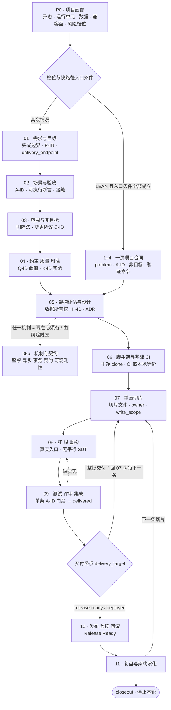
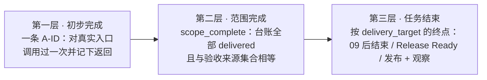

# General Workflow

一套给 agent 用的**从零搭建软件项目**的开发工作流。它不是一份让人读的流程手册，而是一组
agent 每轮只加载一份、按证据推进、并且能被脚本拒绝的阶段门禁。

主线从"要解决谁的什么问题"开始，经过架构与工程基础，交付一条真实可运行的垂直切片，再进入
测试、发布和运行反馈。整个过程可以跨会话接手，也可以随时插入第二个人。

## 总图



三件事值得先说清楚：

- **只有阶段 1–4 会合并。** LEAN 档位把它们压成一页项目合同；05 之后所有档位都逐阶段路由，
  LEAN 改变的是每个阶段要求的证据量，不是阶段数。减免清单只有
  [`00-lean-path.md`](references/00-lean-path.md) 那一份，没列到的门禁照原样执行。
- **09 之后往哪走不是判断题**，查 `delivery_target` 的终点：整批交付就留在 07 继续认领，
  直到台账没有 remaining；逐条上线才进 10。
- **任意阶段都可能回流。** 拆解暴露意图歧义、核心目标矛盾或画像前提失效时先回 P0；
  局部问题按最小影响回退到 01/02/03/04，见下面的[回流表](#回流按最小影响回退)。

## 它和一份流程手册的区别

四条规则决定了其余全部形态：

1. **按最早未满足的「事实」路由，不是按最早缺失的「文档」。** 文件存在不代表门禁通过。
2. **一次只加载一份 reference。** 常驻的只有 `SKILL.md` 和 router，其余按阶段付费。
3. **完成是可以被机器拒绝的状态，不是可以被叙述的判断。** 验收来源与台账做集合相等校验，
   `delivered` 单调不可退且必须带证据指针。
4. **状态分片落盘。** 最频繁的写入只碰一个单人独占的文件，所以第二个人可以随时插进来。

## 安装

这个仓库本身就是 skill 包。`archive/` 不属于安装内容。

**必须把 `scripts/` 一起装上** —— 每个有状态的会话，router 第一步就要调用
`scripts/workflow_status.py`；只拷 `SKILL.md` 和 `references/` 会让它第一步就失败。

```powershell
git clone git@github.com:Brianky111/general-workflow.git
Copy-Item -Recurse general-workflow "$HOME\.claude\skills\general-workflow"
Remove-Item -Recurse -Force "$HOME\.claude\skills\general-workflow\archive"
```

```bash
git clone git@github.com:Brianky111/general-workflow.git
cp -r general-workflow ~/.claude/skills/general-workflow
rm -rf ~/.claude/skills/general-workflow/archive
```

要一边用一边改这套流程，就别拷贝，直接链接过去（Windows 需要开发者模式或管理员权限）：

```powershell
New-Item -ItemType SymbolicLink -Path "$HOME\.claude\skills\general-workflow" -Target "<本仓库绝对路径>"
```

Codex 侧用 `agents/openai.yaml` 提供入口元数据，包内容相同，按你本地 Codex 的 skill 目录约定放置。

装完确认一下（应当输出 `uninitialized`，因为随便挑的目录还没有状态）：

```powershell
python "$HOME\.claude\skills\general-workflow\scripts\workflow_status.py" --root "C:\some\project"
```

## 怎么用

### 第一次会话

在你的项目目录里直接说要做什么，或者用 `/general-workflow` 显式触发：

> 我要做一个内部用的报表导出工具，Python，先跑起来。用 general-workflow。

agent 会按固定顺序动作：先读 router → 找 `docs/workflow/`（没有就推导阶段）→ 建立项目画像
和风险档位 → 选中最早未满足门禁的那个阶段 → 只加载那一份 reference → 本轮结束前建立状态文件。

每轮结束它都会报告：画像、当前阶段和为什么从这里开始、已确认决策与未决阻塞、当前验收场景、
产出和退出门禁、下一步一个可执行动作及其验证命令。

### 它会问你什么

只问会改变**行为、范围、数据含义、安全、兼容性、成本、不可逆效果或所有权**的决策，格式固定：

```markdown
决策：<会改变的行为/范围/数据/安全/成本>
背景：<已知事实和候选方案>
推荐：<方案及理由>
代价：<接受什么、放弃什么>
不决策的后果：<会阻塞哪条路径>
```

不会问"请确认所有内容"，也不会在没有新信息时重复问已经定过的选择。可选模板缺失、目录命名
偏好、没有触发条件的完整测试矩阵，都不构成阻塞。

### 继续一个已有项目

先跑状态脚本，再说"继续上次那个项目"或"下一步做什么"：

```powershell
python "$HOME\.claude\skills\general-workflow\scripts\workflow_status.py" --root "<项目绝对路径>" --json
```

它输出当前切片、owner、stage、未认领的 A-ID、`scope_verified` 和 `scope_complete`，
并在状态有问题时退出码非零。**退出码非零就先修状态，不要在失真的游标上继续推进。**

脚本判不了的，靠三次廉价校验：切片里的 `stage` 和 A-ID 指向的代码/测试是否真的存在；最近一次
evidence 的调用现在是否仍返回同样结果；`updated` 的 commit 是否落后于 HEAD。任意一项对不上，
以仓库为准修正状态。

### 第二个人加入

跑一次脚本，看见哪些 A-ID 未认领，认领一条，开工。认领 = 在自己的切片文件里写上 `owner`、
`claimed`、`write_scope`，同时把 backlog 里对应 A-ID 的 slice 列指向该切片。规则见
[`99-state-and-handoff.md`](references/99-state-and-handoff.md)：一次只持有一条在途切片，
不抢有新鲜证据的切片，写入范围重叠先调边界再开工，不做了要走归还流程而不是删行。

## 你的项目里会出现什么

只有一个目录，**分片存放**，这样第二个人可以随时插入：

```text
docs/workflow/
  project.md          档位 · 路径 · lifecycle · 权威来源 · delivery_target   ← 罕见变更
  backlog.md          每个 A-ID 归属哪条切片，或 - / deferred / dropped      ← 共享，只记归属
  slices/
    S-01.md           owner · claimed · stage · write_scope · 验收状态 · 证据 ← 单一 owner 独占
    S-02.md
```

关键是 **`stage` 属于切片而不是项目**：甲在 S-01 做阶段 8、乙在 S-02 做阶段 5，一个共享的
`stage` 字段表达不了这件事——那不是合并冲突，是模型缺陷。状态只写在切片文件里，backlog 只记
归属，所以最频繁的操作（改状态）永远只碰一个单人独占的文件。

填好之后大致长这样：

```markdown
<!-- docs/workflow/project.md -->
# Project
updated: 2026-09-09 / a1b2c3d

- lifecycle: BUILDING
- tier: LEAN
- path: lean
- acceptance_source: docs/contract.md#验收场景
- delivery_target: docs/contract.md#完成边界 / deployed:staging
```

```markdown
<!-- docs/workflow/backlog.md -->
| A-ID | slice | note |
| --- | --- | --- |
| A-01 | S-01 | |
| A-02 | S-01 | |
| A-03 | -    | |
| A-09 | deferred | 变更记录 C-03 |
```

```markdown
<!-- docs/workflow/slices/S-01.md -->
# Slice S-01: 导出报表
- owner: alice
- claimed: 2026-09-09 / a1b2c3d
- stage: 9 测试评审集成
- write_scope: src/report; tests/report
- architecture_hypothesis: H-01

## Acceptance
| A-ID | status | evidence |
| --- | --- | --- |
| A-01 | delivered | `app export --from 2026-09-01` → exit 0, 写出 report.csv 3 行 @ a1b2c3d |
| A-02 | in-slice | - |
```

状态是**游标和索引，不是第二份真相**：它用指针引用需求、ADR、测试和发布证据的权威位置，
不复制内容；与仓库事实冲突时，仓库事实赢。项目已有 issue、ADR 目录或发布系统时，状态只补
它们没有的那部分。

## 「完成」的三层



**第一层是最容易被糊弄的一层，所以它是硬条件**：读代码、看 diff、"实现看起来对"都不算；
连"测试全绿"本身也不算——测试通过是必要条件，不是充分条件，它证明的是断言成立，不是那个入口
真的能被调起来并返回预期结果。evidence 写成 `<调用> → <观察到的结果> @ <commit>`，
箭头两侧都不能空，脚本按这个形状拒绝：

```text
pytest tests/items -q: 12 passed @ abc123          ✗ 只有命令，没有观察结果
https://ci.example/run/8821                        ✗ 只有链接
已阅读 router.py，实现完整且已注册                   ✗ 读代码不是调用
POST /items {"name":"x"} → 201 id=it_7 @ abc123     ✓
打开 /orders → 首屏渲染 3 行，空态文案正确 @ abc123   ✓
```

每种形态都有可调用、可观察的入口：

| 形态 | 调用什么 | 观察什么 |
| --- | --- | --- |
| HTTP/RPC 后端 | 生产启动时真实注册的路由，带真实身份和具体输入 | 状态码、响应体、落库行、发出的事件 |
| CLI / 定时任务 | 真实命令或调度入口（进程内走组合根也算） | 退出码、stdout、产出的文件、副作用 |
| 纯前端 | 真实页面路由或交互，浏览器自动化或真实挂载 | 渲染出的内容、DOM 断言、发出的请求 |
| 前后端分离 | 两侧入口各调一次 | 各自结果，外加一条跨端调用证明整条路径 |

第三层的终点取自**用户已给的授权**，不由 skill 扩大或缩小：`implementation-and-tests`
在 09 后结束，`release-ready` 必须过 10 的 Release Ready，`deployed:<环境>` 必须完成该环境的
发布和观察窗口。`scope_complete` 只表示验收台账完成；脚本退出码 0 也只表示状态有效。

## 档位与路径

档位只决定**最低证据**，不限制你主动要求更严格的流程。

| 档位 | 适用信号 | 相对完整路径的差别 |
| --- | --- | --- |
| **LEAN** | 单团队、单运行单元、数据可恢复、无对外兼容承诺、无资金/隐私/合规 | 1–4 合并成一页合同；05 只出一页决策表；跳过 05a（除非有机制"现在必须有"）；09 不要求合同测试、E2E 矩阵和专项测试；10 不要求独立 staging 和三段环境隔离；11 简化为一次 closeout |
| **STANDARD** | 多个业务模块、持久化数据、异步或第三方依赖、多环境、多人协作 | 逐阶段推进，机制与契约按标记加载 05a，09 增加集成与合同证据 |
| **HIGH-RISK** | 支付/资金、隐私合规、公共 API、不可逆迁移、严格 SLA、跨团队共享契约 | 在完整路径上加：独立评审、威胁建模、容量基线、迁移演练、分批发布、审计记录 |

LEAN 有两条不打折：**06 的干净 clone 验证和一条 CI**（没有远端时用本地等价记录 +
`ci: local-only` 未决事项），以及**每个 A-ID 至少一条指向真实入口的调用证据**。
升级触发一旦成立就立即切回完整路径，已有产出直接搬运，不作废。

## 回流：按最小影响回退

| 触发 | 回到 | 为什么是这一级 |
| --- | --- | --- |
| 用户/情境/入口/核心结果与原始请求不一致；关键需求互相矛盾 | **P0** | 要重新决定"解决什么问题"，画像和档位都可能失效 |
| 新证据显示存在必须兼容的旧接口、旧数据或线上部署 | **P0** | `compat_surface` 不再是 none，Greenfield 边界不成立 |
| 目标明确，但单条需求措辞不清 | 01 | 含义没歧义，只是没写成可验证行为 |
| 验收断言不具体；场景遗漏 | 02 | 需求成立，缺的是可观察边界 |
| 版本优先级不清；范围要增删 | 03 | 走变更协议，先更新验收来源再同步台账 |
| 阈值或风险实验缺失；质量目标要成为验收条件 | 04 | 要写成可测量的 Q-ID，含测量方式和阈值 |
| 切片被迫绕开既有边界；出现循环依赖或跨表写入 | 05 | 边界本身有问题，不是实现难 |
| 工具链或环境不可重复 | 06 | 后续每一步的可重复性都建立在这里 |
| 09 发现缺少实现 | 08 | 测试与集成没问题，回实现循环 |
| 发布或恢复暴露新风险 | 10 | 范围不变，补的是运行准备 |

回流不作废已有产出：保留已有 ID 和证据，按变更协议补项，不能删改承诺凑出完成。

## 阶段一览

| 阶段 | 把什么不确定性降下去 | 退出门禁的关键证据 | Reference |
| --- | --- | --- | --- |
| P0 | 需要多深的流程 | 形态、用户与入口、问题与核心结果、风险档位可说明 | [00-project-profile](references/00-project-profile.md) |
| 01 | 做了很多代码却没解决问题 | 完成边界覆盖本次全部承诺结果、必要约束和交付位置 | [01-requirements-and-goals](references/01-requirements-and-goals.md) |
| 02 | "正确处理"这类不可验证的需求 | 每个承诺结果都有 A-ID；照着场景能敲出一条会失败的断言；接缝已命名 | [02-scenarios-and-acceptance](references/02-scenarios-and-acceptance.md) |
| 03 | 首版无边界地膨胀 | 删除法结论、至少一条具体非目标、版本边界与变更协议 | [03-scope-and-nongoals](references/03-scope-and-nongoals.md) |
| 04 | "高性能""高可用"当成验收 | Q-ID 有测量方式和阈值；高风险未知有实验、通过条件和处置 | [04-constraints-quality-risks](references/04-constraints-quality-risks.md) |
| 05 | 系统形态在实现中无意形成 | 形态选择的理由、数据所有权、依赖方向、带 H-ID 的架构验证计划 | [05-architecture-design](references/05-architecture-design.md) |
| 05a | 机制层长期锁死行为 | 每项机制有结论、失败语义和一条计划中的证据 | [05a-mechanisms-and-contracts](references/05a-mechanisms-and-contracts.md) |
| 06 | 环境问题拖累第一条切片 | 干净 clone 跑通 check 与 build；一条 CI 或本地等价记录 | [06-scaffolding-and-ci](references/06-scaffolding-and-ci.md) |
| 07 | 在文档里假设一切可行 | 真实入口到真实结果的最短路径；切片文件齐备且脚本退出 0 | [07-vertical-slice](references/07-vertical-slice.md) |
| 08 | 用平行系统制造假绿色 | Red 原因已确认；接入真实注册的生产入口；绿之后立刻发起一次真实调用 | [08-implementation-tdd](references/08-implementation-tdd.md) |
| 09 | 各模块单测通过 ≠ 用户结果成立 | 单条：调用过并记下返回；批次：全部 Must 已 delivered、产物可追溯 | [09-testing-review-integration](references/09-testing-review-integration.md) |
| 10 | 发得出去但收不回来 | 不可变产物、迁移与回滚方案、阈值与观察窗口、可执行 runbook | [10-release-operations](references/10-release-operations.md) |
| 11 | 凭偏好自动重构 | 运行证据对照 Q-ID 与 H-ID；下一步只有一个有边界的动作 | [11-retrospective-evolution](references/11-retrospective-evolution.md) |

路由、生命周期状态和全局门禁在 [`00-progress-router.md`](references/00-progress-router.md)；
LEAN 快路径在 [`00-lean-path.md`](references/00-lean-path.md)；跨会话状态与认领规则在
[`99-state-and-handoff.md`](references/99-state-and-handoff.md)。

### 阶段 5 会逼你回答的问题

按证据决定，不套固定模板：采用简单单体、模块化单体、应用加 worker、多服务还是事件驱动？
代码按技术分层、按业务模块，还是模块化加分层？哪个模块拥有哪类数据，哪些不变量必须保持？
是否需要鉴权、审计、多租户、异步任务、幂等、补偿、缓存、限流？API/事件如何版本化并统一错误
表达？技术栈为什么适合当前团队、风险和生命周期？如何构建、迁移、部署、观察、回滚和恢复？

小项目不必强行使用完整分层或微服务；高风险项目即使代码量很小，也不能省略安全、迁移、兼容和
恢复判断。

## 仓库结构

```text
.
├── SKILL.md                            # 常驻入口：使用边界、核心原则、主生命周期、Reference Map
├── agents/openai.yaml                  # Codex 入口元数据
├── references/                         # 按阶段加载，一次一份
│   ├── 00-progress-router.md           # 常驻：路由算法、阶段选择表、全局门禁
│   ├── 00-project-profile.md
│   ├── 00-lean-path.md
│   ├── 01 … 11                         # 各阶段
│   └── 99-state-and-handoff.md         # 状态文件、台账、认领规则、完成判定
├── scripts/
│   ├── check_consistency.py            # 校验本仓库自身
│   └── workflow_status.py              # 随 skill 分发，在目标项目里跑
├── tests/                              # workflow_status.py 的回归测试
├── archive/general-workflow-v0.12.0/   # 旧版只读参考，不属于安装包
├── CHANGELOG.md
└── LICENSE
```

## 校验

两个脚本面向不同对象。改了 `SKILL.md` 或 `references/`，在**本仓库**跑：

```bash
python scripts/check_consistency.py
python -B -X utf8 -m unittest discover -s tests -p "test_*.py"
```

一致性校验器检查：Reference Map 与实际文件一一对应；引用可解析且能从 router 到达；11 个阶段
和 P0 存在且顺序正确；各阶段关键门禁存在，且**门禁小节还有正文**（anchor 在自己的小节内检查，
留标题清空正文不算通过）；`scripts/workflow_status.py` 和 `tests/` 存在，文档里出现的每个
`scripts/*.py` 路径可解析；常驻入口和单份 reference 没有超出体积预算（用到 90% 给 WARN）；
旧版归档存在且没有被当前主线引用为必需阶段。它不检查 `README.md` 和 `CHANGELOG.md`。

`workflow_status.py` 随 skill 分发，`--root` 指向**使用这套工作流的项目**，目标仓库无需
复制脚本。发现验收遗漏、`delivery_target` 未填、delivered 无证据或证据里没有观察结果、
deferred/dropped 的 note 不指向变更记录、切片归属不一致、写入路径重叠、认领信息缺失或同一
owner 持有多条在途切片时，退出码非零。字段只从第一个 `##` 之前的头部读取，围栏示例和 Blockers
里的叙述不会被当成认领。完全未初始化时仍可开始工作；状态只剩部分文件时报错。

脚本检查的是当前文件的一致性和证据形状；用户授权、来源是否被错误删改、证据是否真实通过以及
发布结果，仍需按阶段规则核验。

## 与旧版的关系

旧版是以 feature/change round、Delivery Anchor、TOS 和复杂状态治理为中心的流程，已完整保存在
[`archive/general-workflow-v0.12.0/`](archive/general-workflow-v0.12.0/)。当前版本只针对
Greenfield，不把旧项目接手、重构、迁移或线上故障恢复自动塞进流程——发现任务其实是这些时，
router 会先说明边界并请你确认是否扩展范围。

## 许可

MIT，见 [LICENSE](LICENSE)。
